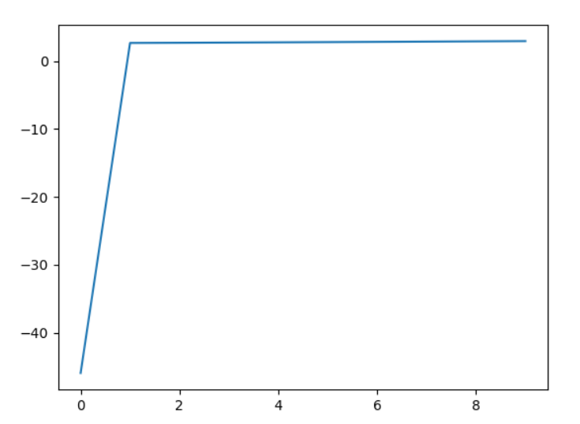

# 机器学习与数据挖掘

# Assignment 4实验报告

>姓名：507
>
>学号：18340057
>
>班级：计算机科学二班

## 一、 理论知识

### 1.1 K-Means   

给定一组数据集，聚类算法将它们分成不同的子组。我们希望类内实例高度相似，类间实例低相似。

在样本集中，随机选取K个点作为中心$\bold \mu_k$，计算每个样本到中心点的距离，并将样本划分到离它最近的那个点的集群中。使用变量$r_{nk}$表示数据样本$\bold x^{(n)}$是否属于集群k：
$$
r_{nk}=\left\{\begin{matrix}1,k=arg\min_j||\bold x^{(n)}-\mu_j||^2\\0,otherwise\end{matrix}\right.
$$
对于每个集群，用所有样本的平均位置更新中心点的位置：
$$
\mu_k=\frac{\sum^N_{n=1}r_{nk}\bold x_n}{\sum^N_{n=1}r_{nk}}
$$
重复上面的样本分配和中心更新过程即可，该过程是保证收敛的。类内距离之和会随着K的增大而减小，因此选择K的时候考虑寻找使得距离基本收敛的K值或是依据下游应用需求选择K值。

K平均聚类的结果高度依赖于初始化的中心点。选择初始化中心点的一般方法有：

- 随机选择：随机选择数据样本作为初始中心。问题在于有可能选择了距离很近的多个样本作为初始中心
- 基于距离的方法：一开始随机选一个样本作为中心点，其他时候选择离各个中心最远的样本作为中心点。问题在于可能选到异常值
- 随机+距离方法：第一个中心点为随机选择的样本，从全部远离现有中心的样本中随机选择下一个中心

一个点要么属于一个集群，要么不属于，存在赋值难的问题。可以用软K平均算法解决：
$$
r_{nk}=\frac{e^{-\beta}||\bold x^{(n)}-\mu_k||^2}{\sum^K_{i=1}e^{-\beta}||\bold x^{(n)}-\mu_i||^2}
$$
这样一来，$r_{nk}$可以理解为样本属于某个集群的几率。

该算法还对异常值敏感。而且欧几里得距离决定了决策边界是球形的，当不同簇的形状不规则时，性能可能不佳。

### 1.2 GMM与EM算法

在监督学习中，回归和分类都可以理解为学习的条件概率分布。类似地，从概率建模的角度来看，无监督学习可以理解为对输入数据的概率分布进行学习，最简单的方法是假设该分布为高斯形式。但是一般情况下，样本的分布比高斯分布复杂得多。为了更好地建模，就需要更好的分布表示方法，即使用复杂的分布，但是训练成本又会增加。

因此，一个直观的思路是使用很多简单模型的加和表示复杂模型：
$$
p(\bold x)=\pi_1p_1(\bold x)+\pi_Kp_K(\bold x)
$$
其中，所有$\pi$的和为1，用来使得分布合法。而每个$p_i$表示简单的分布。上面的每一项又可以看作是联合分布的边缘分布：
$$
p_z(\bold x)\pi_z=p(\bold x|z)p(z)=p(\bold x,z)
$$
这种模型被称为潜变量模型LVM。我们将各个分布看做是高斯分布，则该模型又称为高斯混合模型，即GMM。如果一个高斯混合模型由$K$个高斯分布组成，则总的分布表达式为：
$$
p(\bold x)=\sum^K_{k=1}\pi_kN(\bold x;\bold\mu_k,\bold\Sigma_k)
$$
其中，$K$表示高斯分布的个数，$\pi_k$表示第$k$个分布的权重。$\sum^K_{k=1}\pi_k=1$。$\bold \mu_k$和$\bold \Sigma_k$是第$k$个高斯分布的均值向量和协方差矩阵。

EM算法可以学习高斯混合模型的参数，使得该模型在特定的数据集下获得更大的对数似然函数值。算法分为E和M两步。E指评估预期，M指更新数据：

- E-step：$Q(\bold\theta;\bold\theta^{(t)})=E_{p(\bold z|\bold x;\bold\theta^{(t)})}[\log p(\bold x,\bold z;\bold \theta)]$
- M-step：$\bold\theta^{(t+1)}=\arg\max_\bold\theta Q(\bold \theta;\bold\theta^{(t)})$

对于上述的高斯混合模型，在E-step中，可以求得对数似然函数为：
$$
\log p(\bold x,\bold z;\bold \theta)=\sum^K_{k=1}z_k\cdot[\log N(\bold x_n|\bold \mu_k,\bold\Sigma_k)+\log\pi_k]
$$
令：
$$
\gamma_k^{(t)}\triangleq\frac{N(\bold x_n|\bold \mu^{(t)}_k,\bold\Sigma^{(t)}_k)\pi_k}{\sum_{i=1}^KN(\bold x_n|\bold \mu^{(t)}_k,\bold\Sigma^{(t)}_k)\pi_i}
$$
则有：
$$
Q(\bold\theta;\bold\theta^{(t)})=\sum_{k=1}^K\gamma_k^{(t)}[\log N(\bold x_n|\bold \mu_k,\bold\Sigma_k)+\log\pi_k]
$$
然后在M-step更新各个参数：
$$
\bold\mu_k^{(t+1)}=\frac1{N_k}\sum^N_{n=1}\gamma_{nk}\bold x_n\\
\bold\Sigma_l^{(t+1)}=\frac1{N_k}\sum^N_{n=1}\gamma_{nk}(\bold x_n-\mu_n^{(t+1)})(\bold x_n-\mu_n^{(t+1)})^T
\pi_k^{(t+1)}=\frac{N_k}N
$$
其中$N_k=\sum^N_{n=1}\gamma_{nk}$，表示第$k$类的样本的有效数量。反复执行E和M两步训练参数，直至模型收敛或到达最大训练次数即可。

-----------

## 二、 代码实现

### 2.1 K-means

在K-means算法中，我们将训练数据集分成若干个聚类，对每个类打上标签后对训练样本进行分类，将属于的类的标签当做预测结果即可。

#### 2.1.1 中心点的选择

K平均算法的核心就是中心点的选择和更新。对于本次实验使用的MNIST数据集，样本共有10类，因此聚类时选择10个不同的中心点。初始化中心点有多种方法，我会在之后的实验结果分析中分析不同的初始化方法对结果的影响。

下面的代码以随机选择为例子。在全部样本点中选择十个样本点作为初始化中心：

```python
# 设置基本参数
k = 10  # 类别数
t = 100 # 迭代次数
# 生成初始中心
# 完全随机
center_points = np.random.choice(train_images.shape[0], k, replace = False).tolist()
for i in range(len(center_points)):
    center_points[i] = train_images[center_points[i]]
center_points = np.asarray(center_points)
```

同时，我还对基于距离的方法进行了尝试。即，第一个中心点为随机选择的样本点，第二个中心点为离第一个中心点最远的样本点，第三个中心点为距离第一和第二个中心点距离之和最大的样本点，以此类推：

```python
center_points = genCenterPoints(train_images, k)
```

```python
# 基于距离选择中心点
def genCenterPoints(train_images, k):
    # 第一个中心点随机选择
    center_points = [train_images[random.randint(0,train_images.shape[0]-1)].tolist()]
    while len(center_points) != k:
        print(len(center_points))
        dist = None
        point = None
        # 遍历每个样本点
        for each in train_images:
            # 不考虑已经作为中心点的样本点
            if each.tolist() in center_points:
                continue
            # 计算当前样本到各个中心点的距离之和
            tmp_dist = np.sum(np.linalg.norm(np.asarray(center_points) - each,axis = 1))
            # 选择距离最短的样本点作为下一个中心点
            if dist==None or tmp_dist<dist:
                point = each
                dist = tmp_dist
        center_points.append(point.tolist())
    return np.asarray(center_points)
```

#### 2.1.2 训练过程

之后就是对各个样本点进行分类和中心点的迭代更新：

```python
# 进行迭代
for i in range(t):
    # 对训练样本进行分类
    r = classification(center_points,train_images, k)
    # 更新中心点位置
    center_points = updateCenterPoints(r, train_images, k)
```

对样本点进行分类时，使用数组`r[i][j]`表示第`i`个样本是否属于第`j`类。是则为1，否则为0。计算出当前样本和各个中心点之间的距离，选择最近的中心点作为该样本属于的类别即可。这里我调用了`np.linalg.norm`来计算距离，得到的是欧式距离，也就是各个特征值的平方和开根号作为距离。样本距离可以采用不同的标准，会对分类的结果产生不同的影响。

```python
def classification(center_points,train_images, k):
    # r[i][j]表示第i个样本是(1)否(0)属于第j类
    r = np.zeros((train_images.shape[0],k)).astype(np.int16)
    for i in range(train_images.shape[0]):
        # 计算样本距离各个中心点的距离
        distance = np.linalg.norm(center_points - train_images[i], axis=1)
        # 将相距最近的中心点所属的类作为该样本的类
        r[i][np.argwhere(distance==np.min(distance))[0][0]] = 1
    return r
```

将每个样本成功归类后就要更新中心点的位置。 这里的中心点位置需要到该类中各个样本点的距离最短，因此是各个样本点的平均位置。同样，这里采用不同的距离度量方式也可以产生不同的结果。

```python
# 更新中心点位置
def updateCenterPoints(r, train_images, k):
    center_points = np.empty((k,train_images.shape[1]))
    for i in range(k):
        # 类内样本特征值之和除以样本数，即平均特征值
        center_points[i] = np.sum(train_images*(np.repeat(r[:,i].reshape(1,-1),\
train_images.shape[1],axis=0).T),axis=0) / np.sum(r[:,i])
    return center_points
```

#### 2.1.3 聚类标签的获取

现在我们得到了十个聚类的中心点。经过训练，我们期望这些点能够对数据进行分类。然而我们不知道每个中心点对应的是哪一个标签。因为训练集中，每个类中有多个样本，可以让这些样本进行投票，每个样本为自身表示的标签进行投票，票数最多的标签就作为该中心点所代表的类的标签：

```python
labels = (genLabels(r, train_labels, k)).astype(np.int16)
```

```python
# 对每个聚类打上标签
def genLabels(r, train_labels, k):
    labels = np.empty(10)
    # 第一层循环遍历每个聚类
    for i in range(k):
        # 第二层循环统计该类中样本属于某一类的个数
        max_count = 0
        max_label = -1
        # 分别对每个标签进行投票
        for j in range(k):
            tmp = np.sum(train_labels[r[:,i]==1]==j)
            # 记录当前票数最多的标签与对应的票数
            if tmp > max_count:
                max_count = tmp
                max_label = j
        labels[i] = max_label
    return labels
```

#### 2.1.4 验证结果

在验证时，只需要比较验证样本与各个中心点的距离，选择距离最近的中心点所代表的类的标签作为预测结果，与实际的验证样本标签相比较即可。

```python
right = 0
for i in range(test_images.shape[0]):
    distance = np.linalg.norm(center_points - test_images[i], axis=1)
    predict = labels[np.argwhere(distance==np.min(distance))[0][0]]
    if predict == test_labels[i]:
        right+=1
print(right,right/test_images.shape[0])
```

### 2.2 GMM

在GMM方法中，我们将不同的训练样本看做一个高斯混合模型的分布。不同的标签对应不同的分布，而每个分布由多个高斯分布组合而成。因此，对于每一类的分布都需要单独训练。

#### 2.2.1 数据预处理

在GMM算法中，需要计算每个样本属于某个分布中的高斯分布的概率。而当特征向量的维数很高时，高斯分布的概率密度函数在特定点的大小就会特别的小。本次的实验中每个样本的维度为784，这么高的维度是不能够应用GMM的，因此首先要考虑对数据进行降维。这里我采用了`sklearn.decomposition`中的PCA模型，使用主成成分分析的方法对数据进行降维：

```python
pca_model = PCA(n_components=50)
pca_model.fit(train_images.T)
train_images = pca_model.components_.T
pca_model.fit(test_images.T)
test_images = pca_model.components_.T
```

每个GMM应该用于拟合一类的样本，因此我们需要给样本进行分类。按照标签将训练样本分为十类，每一类单独用来训练一个GMM：

```python
# 将训练数据按照类别分组
type_num = 10   # 不同标签的个数
tmp = [[] for i in range(type_num)]
for i in range(train_num):
    tmp[train_labels[i]].append(train_images[i])
# train_images[i][j]表示类型为i的第j个样本
train_images = tmp[:][:]

```

#### 2.2.2 训练过程

用每一类单独训练一个GMM：

```python
# 设置基本参数
k = 10      # 每个GMM中高斯模型的个数
t = 100     # 单个GMM迭代次数
GMM = []    # 记录每个类的GMM
for i in range(type_num):
    GMM.append(genGMM(k,t,np.asarray(train_images[i])))
```

训练单个GMM时，首先设置GMM的基本参数和初始值。需要混合高斯模型中，每个高斯分布的均值`gauss_means`、每个高斯分布的协方差矩阵`gauss_var`，以及这些高斯分布在模型中所占的比例`pi`。同时还需要样本属于某个分布的概率值`gamma`。分布的均值由数据集中随机抽取`k`个样本得到，协方差矩阵初始化为单位矩阵。比重和概率一开始都均等。

```python
def genGMM(k,t,train_images):
    # 每个高斯分布的均值，初始化为随机的k个样本点的位置
    train_num = train_images.shape[0]
    gauss_means = np.asarray(train_images[random.sample([i for i in range(train_num)],k)])
    # 每个高斯分布的协方差矩阵
    gauss_var = np.asarray([(1*np.eye(train_images.shape[1])) for j in range(k)])# 对角且相等
    # gamma[i][j] 表示样本i属于第j个高斯分布的概率
    gamma = np.ones((train_num, k)) / k
    # 每个分布的比重
    pi = gamma.sum(axis=0) / gamma.sum()
```

下面开始迭代更新参数。

```python
for i in range(t):
```

本次实验采用EM算法来训练GMM。EM算法的执行过程简单来说，就是在给定的参数下得到对数似然函数的期望，然后进一步更新参数，使得原来的参数下得到的对数似然函数取得最大值。

E步骤的过程如下：

```python
# E-step
# 计算对数似然函数
pdf = np.zeros((train_num, k))
for j in range(k):
    pdf[:, j] = pi[j] * multivariate_normal(gauss_means[j], gauss_var[j],allow_singular=True).pdf(train_images)
    log_likehood = np.mean(np.log(pdf.sum(axis=1)))
    print(log_likehood)
```

这里，我使用了`scipy`库的`multivariate_normal`来生成单个多元高斯分布模型。给定该分布的均值和协方差矩阵，可以得到其概率密度分布。调用`pdf`功能，给出样本，就可以得到该样本在该高斯分布下出现的概率。用`pdf[i][j]`表示在该高斯混合模型下，第`i`个样本属于第`j`个高斯分布的概率。

然后，进行M步骤，按照先前算出来的公式更新参数，使得当前的概率密度期望达到最大值：

```python
# M-step
# 更新各个分布的参数
gamma = pdf / pdf.sum(axis=1).reshape(-1,1)
pi = gamma.sum(axis=0) / gamma.sum()
for j in range(k):
    gauss_means[j] = np.average(train_images, axis=0, weights=gamma[:, j])
    cov = [np.dot((train_images[t]-gauss_means[j]).reshape(-1,1),(train_images[t]-gauss_means[j]).reshape(1,-1)) for t in range(train_num)]
    cov_sum = np.zeros((train_images.shape[1], train_images.shape[1]))
    for l in range(train_num):
        cov_sum += gamma[l][j] * cov[j]
        gauss_var[j] = cov_sum / np.sum(gamma[:,j])
```

每个高斯混合模型需要保留各个高斯分布的均值、协方差，以及他们的权重，这三个参数决定了一个完整的高斯混合模型：

```python
return [gauss_means, gauss_var, pi]
```

#### 2.2.3 验证结果

在得到了所有的高斯混合模型后，需要测试时，将测试样本在每个高斯混合模型下算出其对数似然函数值，用于表示它符合各个高斯混合模型的概率。选择概率最高的那一个模型对应的标签作为预测结果：

```python
right = 0
for l in range(test_images.shape[0]):
    prob = []
    # 依次使用每个GMM进行预测
    for i in range(type_num):
        pdf = np.zeros(k)
        # 用每个模型中的每个高斯分布得到样本分布概率
        for j in range(k):
            pdf[j] = GMM[i][2][j] * multivariate_normal(GMM[i][0][j], GMM[i][1][j],allow_singular=True).pdf(test_images[l])
            # 计算对数似然
        prob.append(pdf.sum())
    prob = np.asarray(prob)
    # 选择对数似然最高的GMM对应的标签作为预测结果
    ans = np.argwhere(prob==np.max(prob))[0][0]
    if ans == test_labels[l]:
        right+=1
print(right, right/test_images.shape[0])
```

-----

## 三、 实验结果与分析

### 3.1 K-means

使用MNIST数据集，同样进行100次迭代，K-means算法中，如果使用随机初始化中心点，准确率为58.9%；如果是基于距离选择的中心点，准确率为59.45%。二者差别不大。

K平均聚类的结果高度依赖于初始化的中心点。选择中心点的策略不同的话可能会得到不同的结果。我们希望选择的初始点有各个类别的代表性，能够很好地区分各个类别。这就要求选择的初始点相距较大。初始时如果是随机选择中心点，即随机选择数据样本作为初始中心，有可能选择了距离很近的多个样本作为初始中心从而导致结果不好。当然也有可能随机选择的中心点较优。总的来说，存在选择较差点的风险。为了避免选到太近的点作为中心点，可以使用基于距离的方法，即一开始随机选一个样本作为中心点，其他时候选择离各个中心最远的样本作为中心点。但是如果这样选择的话，问题在于可能选到异常值，导致聚类结果不准确。更好的方法是结合二者的思想，设定一个距离阈值，在所有超过距离阈值的点中随机选择，这样既避免了选择的点太近，又可以减少选到异常点的概率。

MNIST数据集为手写数字图片的集合。可以想见，相同的位置的像素点，不同的数字更有可能不同，而相同数字更有可能相同。K平均算法处理这样的数据是合理且有效的。

### 3.2 GMM

使用EM训练的GMM算法，初始化数据降维到50，每个GMM含有50个高斯分布，迭代10次，如果协方差矩阵初始化为对角且元素相等，准确率为37.86%；如果对角且不相等则为35.23%。下面的分析以协方差矩阵初始化为对角且元素相等的情况为例。

下图为第一个GMM训练时，对数似然函数值关于训练次数的变化：



模型很快收敛了，但最终的对数似然函数的数值仍然较小，且几乎收敛，说明模型已经尽可能地拟合了数据，但拟合效果仍然不理想，模型不能很好地表示数据的分布。通过输出结果，我发现0、6等标签出现的概率高于其他标签，这说明这几个标签对应的GMM能更好地表示整个数据集，因此在这几个模型下会有更高的对数似然值，甚至比实际标签对应的模型算出来的对数似然值更高。这也侧面体现了模型拟合性能的不足。

可以看到，GMM算法的准确率非常低，而且实际训练过程中，训练时间相较K-means也更长。这应该是数据维度导致的。本次实验处理的数据维度高达784，而单个多变量高斯函数随着维度的上升，概率密度函数会越来越扁平。也就是说，在高维空间上，由高斯分布拟合的数据的概率会非常非常小，即便是在概率最大的均值处也会相当小。高达784维的数据根本不能简单地使用GMM算法运算。使用PCA方法降维又会产生样本信息的损失，且样本本身也不一定符合高斯分布，由此导致了结果性能较差。GMM更适合样本特征向量维度较小的情形。

总的来说，在MNIST数据集下，相比EM训练的GMM算法，K-means算法有着更好的性能。

